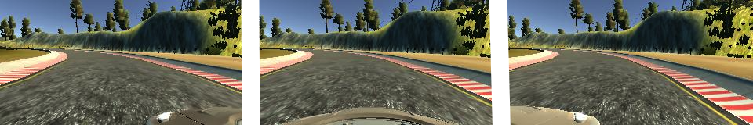
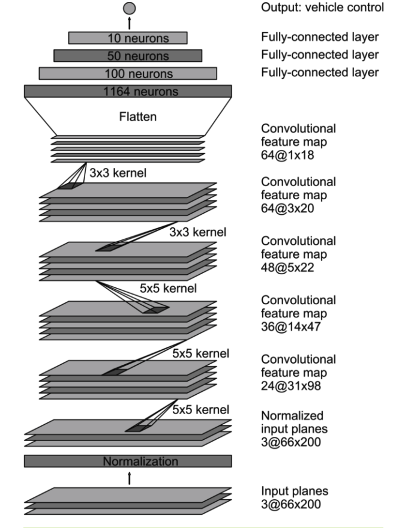
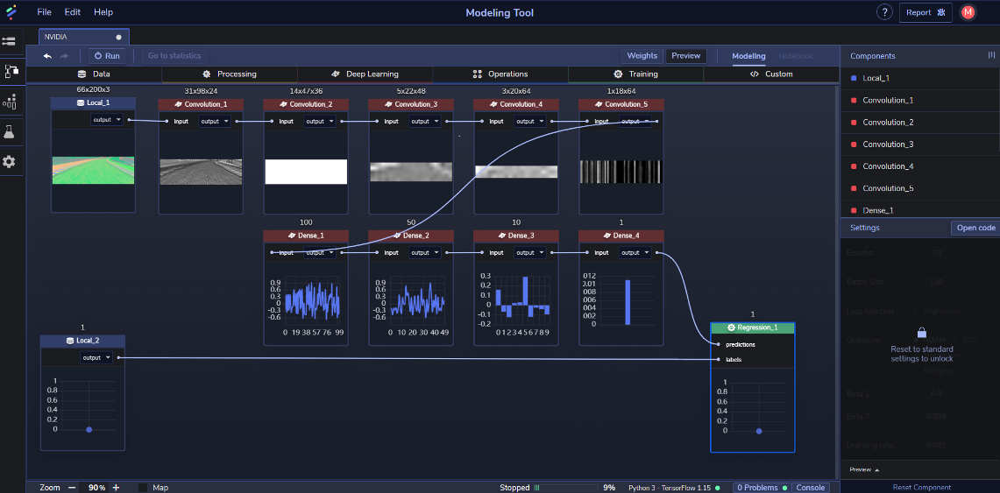

[](https://www.perceptilabs.com/home)

# Nvidia PilotNet
Computer Vision is a key technology for building algorithms to enable self-driving cars. For this model, we've used PerceptiLabs to re-create Nvidia's end-to-end deep learning approach for mapping raw pixels using images captured from front-facing cameras mounted on a car. Each image has a corresponding steering angle associated with it that tells the position of the car's steering for that frame.

To train this model, we have used [Udacity’s Car simulator](https://github.com/udacity/self-driving-car-sim) to collect the dataset. The car captures three pictures - left, center, right - for every single frame using the cameras that are fitted on the front of the car:



Each frame has its own steering angle value that will be used as labels.

We've collected and pre-processed (normalized) the training data and have made it available for use with the model. You can download it [here](https://drive.google.com/drive/folders/1A1OMeS86E86rZ4ViMlvNPcKsb95kaOgM?usp=sharing). 

This normalization process involved dividing the entire image matrix by 255 to bring all the values on the same scale (i.e., 0 to 1). This was done using Google [Colab](https://colab.research.google.com/) along with other preprocessing functions. The following is the preprocessing code used that makes the images smaller, performs grayscale conversion, normalizes, etc.:

```python
img = img[60:135, :, :]
img = cv2.cvtColor(img, cv2.COLOR_RGB2YUV)
img = cv2.GaussianBlur(img, (3, 3), 0)
img = cv2.resize(img, (200, 66))
img = img/255
```
Happy hacking!

# PilotNet Architecture
The model is based around the *PilotNet* model which is composed of nine layers: 
* Five Convolutional Layers. These layers, which form a [Convolutional neural network (CNN)](https://en.wikipedia.org/wiki/Convolutional_neural_network), play a big part in computer vision, namely in the training of features using images as input.
* Three Dense layers.
* An output layer (implemented as a fully-connected Dense [component](https://www.perceptilabs.com/docs/components) in PerceptiLabs). 



Network Layout - Credits: [NVIDIA](https://developer.nvidia.com/blog/deep-learning-self-driving-cars/).

Additionally, we have modified the code in our model's components so that each uses *elu* (not *ReLU*) as an activation function, except for the last Dense component (output node). Finally, for the (regression) training component we've kept the batch size at 100 and the epochs at 20, but have modified its code to use mean squared error (MSE) as the loss function. 

# Structure
This repo has the following structure:
* **/PilotNet_Model**: contains the PerceptiLabs model file (model.json).

# Installation
Follow the steps below to load and prepare the sample model in PerceptiLabs:

1. Download the pre-processed data files from [here](https://drive.google.com/drive/folders/1A1OMeS86E86rZ4ViMlvNPcKsb95kaOgM?usp=sharing).
2. Clone or download the sample model from GitHub.
3. On PerceptiLabs' Model Hub screen, import the sample model into PerceptiLabs. When prompted for the model's folder, navigate to and select the location of the **model.json** file obtained in the previous step.
4. Open the topmost **Data** component in the model workspace and set its file to **NVIDIA_X.npy** that you downloaded in Step 1.
5. Open the second **Data** component in the model workspace and set its file to **NVIDIA_Y.npy** that you downloaded in Step 1.

Once you have built your model, it should look something like this:



# Community

Got questions, feedback, or want to join a community of machine learning practitioners working with exciting tools and projects? Check out our [Community page](https://www.perceptilabs.com/community)!

